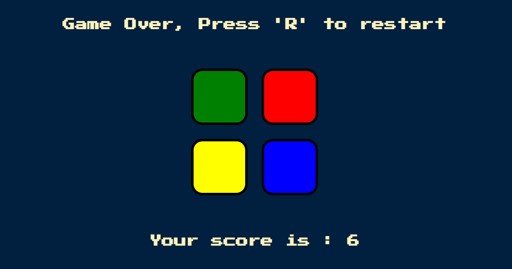

# Simon's Game 🎮

Simon’s Game is a classic memory game where players must memorize and repeat an ever-growing sequence of colors.

## Demo
[Play Simon's Game here!](https://prasukj7-arch.github.io/Simons_game/)  

## Features
- Random color sequence generation
- Level-based difficulty (sequence gets longer)
- Sound and button animations for feedback
- Game over and restart functionality

## Technologies Used
- **HTML5**
- **CSS3**
- **JavaScript**

## How to Play
1. Press any key to start the game.
2. Memorize the flashing color sequence.
3. Repeat the sequence by clicking the colored buttons.
4. Each round adds a new color to the sequence.
5. A wrong click ends the game — press any key to restart.

## Screenshots

## Future Improvements
- Add difficulty levels (Easy, Medium, Hard)
- Track high scores
- Add mobile responsiveness
- Improve animations and sound effects

